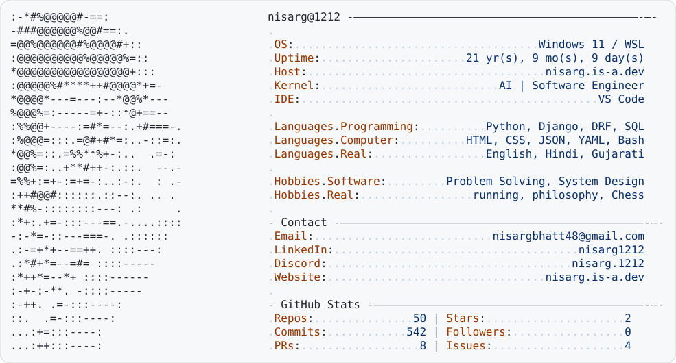
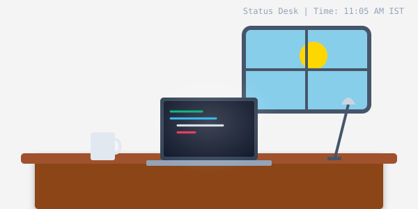
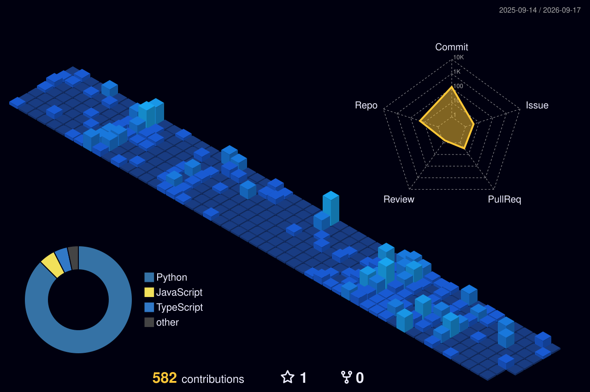

  <picture>
    <source media="(prefers-color-scheme: dark)" srcset="id_badge_dark.svg">
    <source media="(prefers-color-scheme: light)" srcset="id_badge_light.svg">
    
  </picture>
   

  
  
  

---

### 🚀 About Me

I enjoy exploring interesting ideas and turning them into real products.

- 🔭 I’m currently working on **A system that acurately predicts your life after 5 years.**
- 🌱 I’m constantly learning **More Python plus Advanced Backend Architecture & some AI concepts.**
- 💼 Open for **Entry-level Software Engineering roles**

---

### 🛠️ Tech Stack

|                                                                                               **Languages**                                                                                                |                                                                                         **Frontend**                                                                                         |                                                                                    **Backend**                                                                                    |                                                                                   **Tools & Cloud**                                                                                   |
| :--------------------------------------------------------------------------------------------------------------------------------------------------------------------------------------------------------: | :------------------------------------------------------------------------------------------------------------------------------------------------------------------------------------------: | :-------------------------------------------------------------------------------------------------------------------------------------------------------------------------------: | :-----------------------------------------------------------------------------------------------------------------------------------------------------------------------------------: |
|     |     |     |     |

---

### 📂 Top Projects

| Project                                           | Description                                                                 | Tech Stack                     |
| :------------------------------------------------ | :-------------------------------------------------------------------------- | :----------------------------- |
| **[Afterfiveyears.life](https://afterfiveyears.life)**   | A platform for analyzing and reflecting on your life desicions.  | `Django` `Python` `Django-restframework` `React`|
| **[StackX](https://stackxapp.com)**               | A place to find right AI workflows and systems becomes easy.                  | `React` `typescript` `SQLite`      |
| **[Personal Portfolio](https://nisarg.is-a.dev)** | My personal digital garden showcasing my projects, skills, and journey.     | `React` `Vite` `CSS` `Framer`           |

---

### 💻 My Live Status Desk

  
<i>A dynamic, auto-updating SVG showing my current local time and coding status. If the coffee is steaming, I recently pushed code!</i>

  

---

### 🏙️ My GitHub City

  

---

  
<i>Let's build something intresting!</i>

