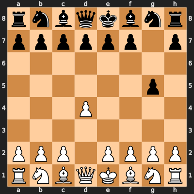

  

  
  
  

 

---

### 🚀 About Me

I find interest in creative problem solving at scale.

- 🔭 I’m currently working on **A system that acurately predicts your life after 5 years.**
- 🌱 I’m constantly learning **Advanced Backend Architecture & System Design**
- 💼 Open for **Entry-level Software Engineering roles**

---

### 🛠️ Tech Stack

|                                                                                               **Languages**                                                                                                |                                                                                         **Frontend**                                                                                         |                                                                                    **Backend**                                                                                    |                                                                                   **Tools & Cloud**                                                                                   |
| :--------------------------------------------------------------------------------------------------------------------------------------------------------------------------------------------------------: | :------------------------------------------------------------------------------------------------------------------------------------------------------------------------------------------: | :-------------------------------------------------------------------------------------------------------------------------------------------------------------------------------: | :-----------------------------------------------------------------------------------------------------------------------------------------------------------------------------------: |
|     |     |     |     |

---

### 📂 Top Projects

| Project                                           | Description                                                                 | Tech Stack                     |
| :------------------------------------------------ | :-------------------------------------------------------------------------- | :----------------------------- |
| **[Worldperience02](https://worldperience.me)**   | A social platform for sharing experiences with global chat and communities. | `Django` `Python` `WebSockets` |
| **[StackX](https://stackxapp.com)**               | Where finding right AI workflows and systems becomes easy.                  | `React` `Tailwind` `JSON`      |
| **[Personal Portfolio](https://nisarg.is-a.dev)** | My personal digital garden showcasing my projects, skills, and journey.     | `React` `Vite` `CSS`           |

---

### ♟️ Play Chess Against My Repo's AI!

  
<i>Make a move by opening an issue! A Python script hosted on GitHub Actions handles logic and responds.</i>

  
    
  

---

### 🏙️ My GitHub City

  

---

  
<i>Let's build something intresting!</i>

